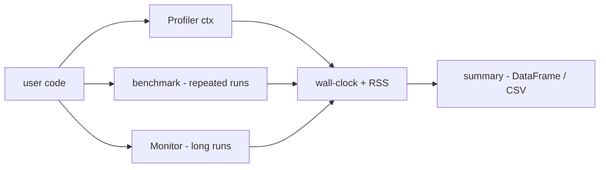
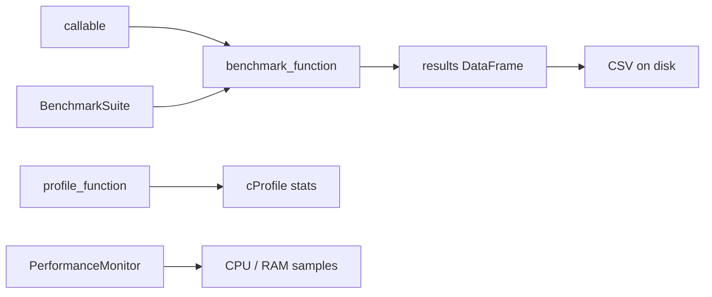

# scitex-benchmark

<p align="center">
  <a href="https://scitex.ai">
    
  </a>
</p>

<p align="center"><b>Performance benchmarking, runtime monitoring, and profiling helpers.</b></p>

<p align="center">
  <a href="https://scitex-benchmark.readthedocs.io/">Full Documentation</a> · <code>uv pip install scitex-benchmark[all]</code>
</p>

<!-- scitex-badges:start -->
<p align="center">
  <a href="https://pypi.org/project/scitex-benchmark/"></a>
  <a href="https://pypi.org/project/scitex-benchmark/"></a>
  <a href="https://scitex-benchmark.readthedocs.io/en/latest/"></a>
</p>
<p align="center">
  <a href="https://github.com/ywatanabe1989/scitex-benchmark/actions/workflows/ci.yml"></a>
  <a href="https://codecov.io/gh/ywatanabe1989/scitex-benchmark"></a>
</p>
<!-- scitex-badges:end -->

---

## Quick Start

```python
import scitex_benchmark as sb

# Single-function benchmark
result = sb.benchmark_function(
    my_func,
    args=(my_input,),
    iterations=20,
    warmup=2,
)
print(f"{result.function_name}: {result.mean_time:.3f}s ± {result.std_time:.3f}s")

# Compare two implementations
df = sb.compare_implementations(
    implementations={"v1": impl_a, "v2": impl_b},
    test_data_generator=lambda: ((input,), {}),
)
print(df)
```

## Demo



<p align="center"><sub><b>Figure 1.</b> Demo. Profile, benchmark, or monitor any callable; results land in DataFrames/CSVs.</sub></p>

## Installation

```bash
uv pip install "scitex-benchmark[all]"
```

<details>
<summary><strong>Extras</strong></summary>

| Extra | Enables |
|-------|---------|
| `all` | Everything below (`dev` + `docs`) |
| `dev` | Test/lint tools (`pytest`, `ruff`, `scitex-dev`) |
| `docs` | Sphinx build (`sphinx`, theme/parser extensions) |

</details>

## Architecture



<p align="center"><sub><b>Figure 2.</b> Architecture. Callables flow into benchmark runs, profilers, or monitors; outputs are DataFrames, CSVs, or stat reports.</sub></p>

## 1 Interfaces

<details open>
<summary><strong>Python API</strong></summary>

<br>

```python
import scitex_benchmark as sb

# Benchmark suite — time across input sizes
suite = sb.BenchmarkSuite("io")
suite.add_benchmark(my_func, gen_input, "name", sizes=["1MB", "10MB"])
results = suite.run()

# Performance monitor — track CPU/RAM/error metrics over time
monitor = sb.PerformanceMonitor()
monitor.start()
long_running_job()
stats = monitor.get_stats()

# Profiler decorator — cProfile instrumentation
@sb.profile_function
def hot_function(x):
    return x ** 2
```

</details>

## Status

Standalone fork of `scitex.benchmark`. Core deps are `pandas` / `numpy` /
`psutil` / `scitex-io` / `scitex-stats` / `scitex-logging`. The umbrella
package's `scitex.benchmark` import path is preserved via a `sys.modules`-alias
bridge. The `scitex-io` / `scitex-stats` convenience builders are core
dependencies, so every suite constructor works out of the box.

## Part of SciTeX

`scitex-benchmark` is part of [**SciTeX**](https://scitex.ai). Install via
the umbrella with `pip install scitex[benchmark]` to use as
`scitex.benchmark` (Python) or `scitex benchmark ...` (CLI).

>Four Freedoms for Research
>
>0. The freedom to **run** your research anywhere — your machine, your terms.
>1. The freedom to **study** how every step works — from raw data to final manuscript.
>2. The freedom to **redistribute** your workflows, not just your papers.
>3. The freedom to **modify** any module and share improvements with the community.
>
>AGPL-3.0 — because we believe research infrastructure deserves the same freedoms as the software it runs on.

## License

AGPL-3.0-only (see [LICENSE](./LICENSE)).

---

<p align="center">
  <a href="https://scitex.ai" target="_blank"></a>
</p>
